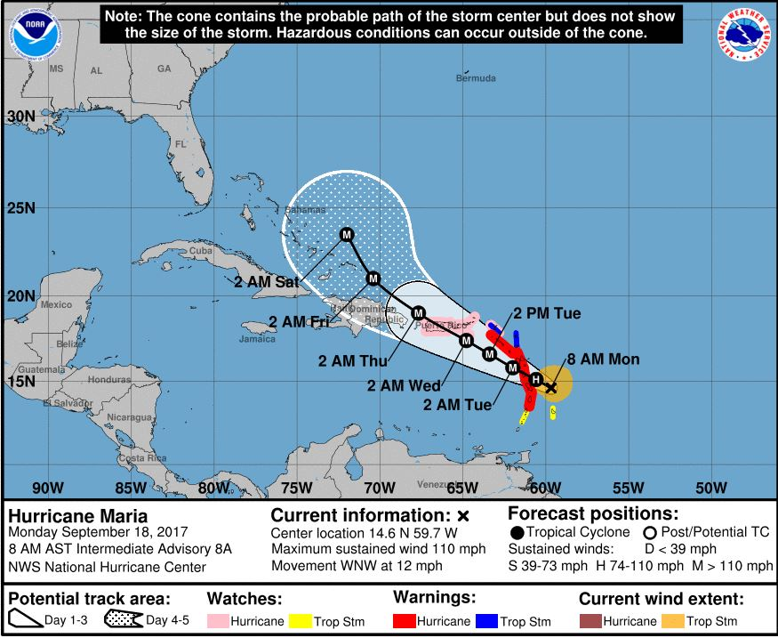

### Predictable Precarity

Hurricanes make life in the Caribbean predictably unpredictable each fall when ocean temperatures rise. Weather forecasters use the term “the cone of uncertainty” to refer to the possible paths a storm might take. Similarly, the ongoing colonial status of many Caribbean nations makes life in the islands inherently unstable because residents are subject to fiscal, social, and environmental laws not of their own making.

The meteorological term “cone of uncertainty” perfectly describes the kind of predictable precarity American and European colonialism forces upon Caribbean peoples. A lack of political representation and second-class citizenship create inherently unstable, unjust and uncertain conditions for islanders. The cone of uncertainty takes many forms, from poor healthcare to a lack of economic opportunities, from shuttered schools to the massive migration out of the region since the 2017 hurricanes. 
