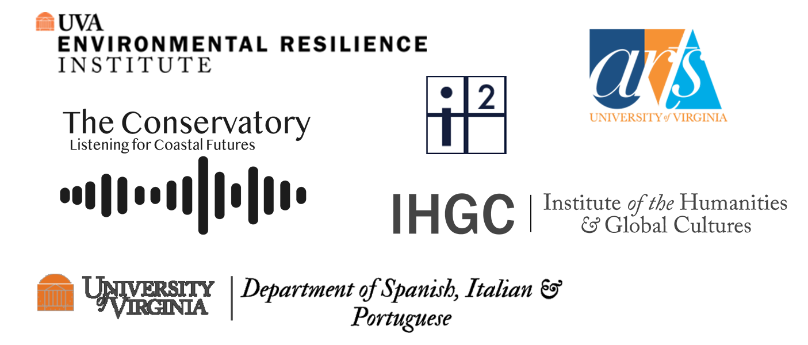

### About

#### Coasts in Crisis: The Power of the Arts in the Hurricane Zone

What is the role of art amid climate disaster?

 

This question has often been overshadowed by well-justified public attention to governmental and scientific responses to environmental catastrophe. As global climate change makes hurricanes more intense and frequent, however, the state’s ability to address crises has fallen short. This is especially the case in the Greater Caribbean, an area that encompasses the archipelago and tropical coastal regions of the hemispheric Americas. The missteps and inactions of local and federal governments have devastating consequences: in the aftermath of Hurricane María in 2017, for example, more than 4,000 people in Puerto Rico died as a direct or indirect result of the storm, yet officials calculated only 64 people had died. When President Trump visited the island after the hurricane, he callously tossed rolls of paper towels at Puerto Ricans, American citizens all, who had been living without accessible food, water, or power for weeks. In the face of this official disregard for Caribbean lives, people of the region have turned to art and collective action for innovative ways of confronting archipelagic disaster.

 

The digital art exhibit “Coasts in Crisis” features art, music, poetry, and photography made by people from the Greater Caribbean after the 2017 hurricane season. In 2019, “Coasts in Crisis” started off as an in-person event on the anniversary of Hurricane María’s landfall, in which seven artists gathered at the University of Virginia to perform and display their art and to discuss why they felt compelled to create when surrounded by destruction. (A video of the recorded event in its entirety is available here.) Amid the wreckage, artists like Sally Binard collected debris and transformed it into art in Florida. In Puerto Rico, Sarabel Santos-Negrón recorded the sounds of Hurricane María, photographed the ruins of her mother’s home, and created an immersive art installation that places the visitor in the hurricane zone. Also in Puerto Rico, the pianist Alfonso Fuentes waited in line for hours to purchase a battery-operated keyboard so that he could compose an ode to the fallen trees. Photographer David Berg rendered visible the “deafening silence” of media inattention to small islands like Dominica and his native St. Croix. Poet Nicole Delgado evoked the difficult decisions about migration confronting hurricane survivors. The photographer Jo Cosme made one such wrenching move: she is one of an estimated 200,000 people displaced by Hurricane María. Before becoming a climate refugee in Seattle, Jo created a deck of tarot cards that chronicled the resistance of ordinary Puerto Ricans to depravation,illness, and injustice after the storm.

 

We invite visitors to explore the site’s three spiraling, overlapping pathways. “Predictable Precarity” describes how hurricane damage is exacerbated by many islands’ colonial and neocolonial status, which makes life inherently precarious because residents are subject to laws not of their own making. “Entangled Ecologies” considers how artists bear witness to the loss of whole multispecies communities, encompassing the deep time of three-hundred year-old trees, the temporary silence of the coquí frog, and the preventable tragedies of human deaths and diasporas. “Creative Resistance” illustrates how art is essential to human thriving in the face of disaster. Amid the ongoing and uneven effects of global climate change, creative practices have emerged as the means through which peoples of the Greater Caribbean survive trauma and make their voices heard. Poetry, music, photography, and art matter after disaster because they reframe one's way of seeing and hearing the world. This new perspective can spark innovative solutions to ecological and social crises. Put simply, art inspires change. "Coasts in Crisis" aims to transform local creative resistance to disaster into a freely accessible, curated digital art project with a transformative global impact.

 

"The whole world is becoming an archipelago," Édouard Glissant writes in Treatise on the Whole-World ("le monde entier s'archipélise").1

 

As sea levels rise, this late-twentieth-century pronouncement its taking on a literal significance to match its conceptual import—what is the Eastern shore of Virginia, or the coast of southern Louisiana, for example, if not a growing chain of islands atop an increasingly submerged continental shelf?

 

"Coasts in Crisis" positions itself along this porous, shifting membrane between continent and island in an expression of solidarity and repair with communities affected by hurricanes. The project is funded by the University of Virginia, an educational institution located on unceded Monacan lands and originally constructed with enslaved labor. The University's founder, Thomas Jefferson, sought to isolate and impoverish Haiti after it liberated itself from French imperial control in 1804. As contemporary members of UVA's academic community, we recognize our university's role in U.S. attempts to marginalize and indebt the nations and peoples of the Caribbean. These power asymmetries linger in our economic and infrastructural capacity to host events and secure payment for the artists and the student workers. The project aims to take a step towards redressing that unequal situation by elevating the work and voices of artists who live under the ongoing shadow of U.S. colonialism and those whose families emigrated from the Caribbean and Latin America to the United States.

 

The dual purpose of the original 2019 "Coasts in Crisis" event was to educate the UVA community about the role of art in responding to hurricanes in the Greater Caribbean and to create a sense of belonging and visibility for the Hispanic and Caribbean communities that are growing within this predominately white institution. The digital iteration of the project aspires to be accessible to a broader archipelagic and continental public, especially as the geoformal distinctions between them are eroded by climate change's rising seas and more powerful and frequent hurricanes. Our graduate student digital designers, Winnie Pérez-Martínez and Rebecca Elise Foote, identify as Puerto Rican and Chicana, respectively, and bring their own experiences with the 2017 hurricane season to this project. The graduate students who conducted the interviews with the artists are of Latinx, Puerto Rican, and white heritage.

 

1Traité du Tout-Monde (Paris: Gallimard, 1997), 164. Our translation. The phrase appears as "the whole world is archipelagizing" in Édouard Glissant, Treatise on the Whole-World, trans. Celia Britton (Liverpool: Liverpool University Press, 2020), 119.

#### Sponsors

